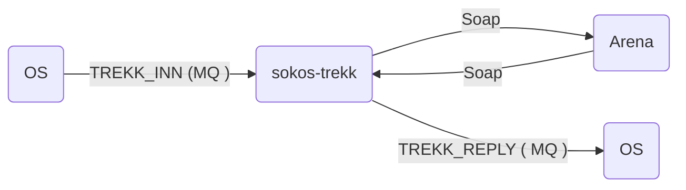
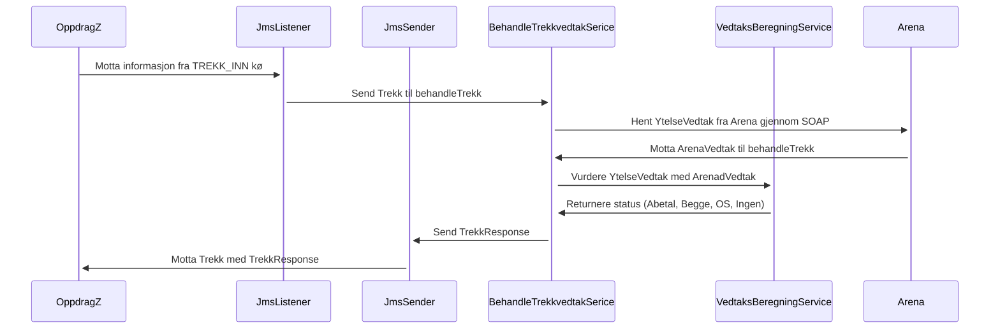

# sokos-trekk

## Innholdsoversikt

* [1. Funksjonelle Krav](#1-Funksjonelle-Krav)
* [2. Utviklingsmiljø](#2-Utviklingsmiljø)
* [3. Programvarearkitektur](#3-Programvarearkitektur)
    * [Integrasjon mot Arena](#Integrasjon-mot-Arena)
    * [Integrasjon mot OS](#Integrasjon-mot-OS)
    * [Forklaring til melding fra OS på TREKK_INN kø:](#Forklaring-til-melding-fra-OS-på-TREKK_INN-kø)
    * [Forklaring til melding til OS på TREKK_REPLY kø:](#Forklaring-til-melding-til-OS-på-TREKK_REPLY-kø)
* [4. Deployment](#4-Deployment)
* [5. Autentisering](#5-Autentisering)
* [6. Drift og støtte](#6-Drift-og-støtte)
* [7. Henvendelser](#7-Henvendelser)

---

# 1. Funksjonelle Krav

Applikasjonens oppgave er å lese inn en liste med trekkvedtak fra Oppdragssystemet og fra ARENA og sammenligne disse.

Ut fra denne sammenligningen gjøres en beslutning på hvor et trekk skal effektueres. Dette kan være OS, Abetal, begge eller ingen.

# 2. Utviklingsmiljø

### Forutsetninger

* Java 21
* [Gradle](https://gradle.org/)
* [Kotest IntelliJ Plugin](https://plugins.jetbrains.com/plugin/14080-kotest)

### Bygge prosjekt

```
./gradlew clean build shadowJar
```

### Lokal utvikling

For å kjøre applikasjonen lokalt må du bruke VDI.

- Kjør scriptet [setupLocalEnvironment.sh](setupLocalEnvironment.sh)
  ```
  chmod 755 setupLocalEnvironment.sh && ./setupLocalEnvironment.sh
  ```
  Denne vil opprette [default.properties](defaults.properties) med alle environment variabler du trenger for å kjøre
  applikasjonen som er definert i [PropertiesConfig](src/main/kotlin/no/nav/sokos/trekk/config/PropertiesConfig.kt).


# 3. Programvarearkitektur



* Oppdragssystemet legger en melding på TREKK_INN-kø.
* `sokos-trekk` leser meldingen på kø.
* `sokos-trekk` finner alle unike fødselsnummer i meldingen og genererer en forespørsel til Arena ytelsesvedtak-tjenesten.
* Ytelsesvedtak returnerer en liste med vedtak fra Arena.
* Trekk går gjennom ytelsene mottatt fra Oppdragssystemet og sammenligner med ytelsene i Arena. Det gjøres ut fra dette en besluttning om hvor hvert trekk skal effektueres
* Trekklisten med tilhørende beslutning returneres, via TREKK_REPLY kø, til Oppdragssystemet.

### Integrasjon mot Arena

Trekk kaller YtelseVedtak_v1 webservice (SOAP) hos Arena. Se definisjon av tjenesten: Trekk - Tjenester som konsumeres.
En ytelsesVedtak-request vil inneholde en ident (fødselsnummer), en periode og en temaliste.

Perioden settes slik:

* fom: dagens dato.
* tom: den siste i neste måned ut fra dagens dato.

Temalisten vil alltid inneholde AAP, DAG og IND.

Eksempel på request til Arena:

```xml

<v1:finnYtelseVedtakListe>
    <request>
        <personListe>
            <ident>12345678901</ident>
            <periode>
                <fom>01-01-2018</fom>
                <tom>31-01-2018</tom>
            </periode>
        </personListe>
        <temaListe>AAP</temaListe>
        <temaListe>DAG</temaListe>
        <temaListe>IND</temaListe>
    </request>
</v1:finnYtelseVedtakListe>
```

### Integrasjon mot OS

Trekk leser meldinger fra OS på køen TREKK_INN og skriver meldinger til OS på køen TREKK_REPLY. Disse meldingene vil valideres mot følgende XSD

<details>
<summary>Click to expand source code</summary>

```xml
<?xml version="1.0" encoding="UTF-8"?>

<xsd:schema xmlns:xsd="http://www.w3.org/2001/XMLSchema"
            targetNamespace="urn:no:nav:maskinelletrekk:trekk:v1"
            xmlns="urn:no:nav:maskinelletrekk:trekk:v1"
            attributeFormDefault="qualified"
            elementFormDefault="qualified">

    <xsd:element name="trekk">
        <xsd:complexType>
            <xsd:sequence>
                <xsd:element name="typeKjoring" type="TypeKjoring"/>
                <xsd:choice>
                    <xsd:element name="trekkRequest" type="TrekkRequest" maxOccurs="1000"/>
                    <xsd:element name="trekkResponse" type="TrekkResponse" maxOccurs="1000"/>
                </xsd:choice>
            </xsd:sequence>
        </xsd:complexType>
    </xsd:element>

    <xsd:complexType name="TrekkRequest">
        <xsd:sequence>
            <xsd:element name="offnr" type="xsd:string"/>
            <xsd:element name="trekkvedtakId" type="xsd:int"/>
            <xsd:element name="trekkalt" type="Trekkalternativ"/>
            <xsd:element name="system" type="System" minOccurs="0"/>
            <xsd:element name="trekkSats" type="xsd:decimal"/>
            <xsd:element name="totalSatsOS" type="xsd:decimal"/>
        </xsd:sequence>
    </xsd:complexType>

    <xsd:complexType name="TrekkResponse">
        <xsd:sequence>
            <xsd:element name="trekkvedtakId" type="xsd:int"/>
            <xsd:element name="beslutning" type="Beslutning"/>
            <xsd:element name="system" type="System" minOccurs="0"/>
            <xsd:element name="totalSatsOS" type="xsd:decimal"/>
            <xsd:element name="totalSatsArena" type="xsd:decimal"/>
            <xsd:element name="vedtak" type="ArenaVedtak" minOccurs="0" maxOccurs="1000"/>
        </xsd:sequence>
    </xsd:complexType>

    <xsd:complexType name="ArenaVedtak">
        <xsd:sequence>
            <xsd:element name="vedtaksperiode" type="Periode"/>
            <xsd:element name="tema" type="xsd:string"/>
            <xsd:element name="rettighetType" type="xsd:string"/>
            <xsd:element name="dagsats" type="xsd:decimal" minOccurs="0"/>
        </xsd:sequence>
    </xsd:complexType>

    <xsd:complexType name="Periode">
        <xsd:sequence>
            <xsd:element name="fom" type="xsd:date" minOccurs="0"/>
            <xsd:element name="tom" type="xsd:date" minOccurs="0"/>
        </xsd:sequence>
    </xsd:complexType>

    <xsd:simpleType name="Beslutning">
        <xsd:restriction base="xsd:string">
            <xsd:enumeration value="OS"/>
            <xsd:enumeration value="ABETAL"/>
            <xsd:enumeration value="BEGGE"/>
            <xsd:enumeration value="INGEN"/>
        </xsd:restriction>
    </xsd:simpleType>

    <xsd:simpleType name="TypeKjoring">
        <xsd:restriction base="xsd:string">
            <xsd:enumeration value="INNL"/>
            <xsd:enumeration value="PERI"/>
            <xsd:enumeration value="REME"/>
        </xsd:restriction>
    </xsd:simpleType>

    <xsd:simpleType name="System">
        <xsd:restriction base="xsd:string">
            <xsd:enumeration value="J"/>
            <xsd:enumeration value="N"/>
            <xsd:enumeration value="B"/>
        </xsd:restriction>
    </xsd:simpleType>

    <xsd:simpleType name="Trekkalternativ">
        <xsd:restriction base="xsd:string">
            <xsd:enumeration value="LOPD"/>
            <xsd:enumeration value="LOPM"/>
            <xsd:enumeration value="LOPP"/>
            <xsd:enumeration value="SALD"/>
            <xsd:enumeration value="SALM"/>
            <xsd:enumeration value="SALP"/>
        </xsd:restriction>
    </xsd:simpleType>
</xsd:schema>
```

</details>

En melding må inneholde en (eller flere) trekkRequests eller en (eller flere) trekkResponse.

En melding kan ikke inneholde både trekkRequest og trekkResponse.

### Forklaring til melding fra OS på TREKK_INN kø:

Meldingen som Oppdragssystemet sender til Trekk-komponenten.

Eksempel på XML på TREKK_INN kø:

```xml
<?xml version="1.0" encoding="UTF-8"?>
<trekk xmlns="urn:no:nav:maskinelletrekk:trekk:v1">
    <typeKjoring>INNL</typeKjoring>
    <!--1 to 1000 repetitions:-->
    <trekkRequest>
        <offnr>12345678901</offnr>
        <trekkvedtakId>3</trekkvedtakId>
        <trekkalt>LOPD</trekkalt>
        <system>J</system>
        <trekkSats>10.0</trekkSats>
        <totalSatsOS>100.00</totalSatsOS>
    </trekkRequest>
    <trekkRequest>
        <offnr>10987654321</offnr>
        <trekkvedtakId>4</trekkvedtakId>
        <trekkalt>SALM</trekkalt>
        <system>N</system>
        <trekkSats>100.0</trekkSats>
        <totalSatsOS>100.00</totalSatsOS>
    </trekkRequest>
</trekk>
```

Forklaring på feltene i XML:

<table>
    <tr>
        <th style="text-align: left" colspan="2">Trekk</th>        
    </tr>
    <tr>
        <td style="vertical-align: top">typeKjoring</td>
        <td>
            Type kjøring i OS med følgende gyldige verdier:<br><br>
            <li><b>INNL</b> - innlesing av nytt trekk</li>
            <li><b>PERI</b> - Periodisk kontroll av trekk</li>
            <li><b>REME</b> - Returmelding til trekkinnmelder ved ingen ytelse</li>
        </td>
    </tr>
    <tr>
        <td style="vertical-align: top">+trekkRequest</td>
        <td>En liste med TrekkRequest fra OS. Må inneholde minst 1, kan maksimalt inneholde 1000</td>
    </tr>
</table>

<table>
    <tr>
        <th style="text-align: left" colspan="2">TrekkRequest</th>        
    </tr>
    <tr>
        <td>offnr</td>
        <td>Fødselsnummer på bruker</td>
    </tr>
    <tr>
        <td>trekkvedtakId</td>
        <td>Oppdragssystemets trekkvedtakId.</td>
    </tr>
    <tr>
        <td style="vertical-align: top">system</td>
        <td>
            Hvor har trekket vært effektuert tidligere. Gyldige verdier:<br><br>
            <li>J (effektuert i Abetal)</li>  
            <li>N (effektuert i OS)</li>
            <li>B (Begge (OS og Abetal)</li>
        </td>
    </tr>
    <tr>
        <td>trekkSats</td>
        <td>Sats på trekket. Max beløp det kan trekkes i en måned</td>
    </tr>
    <tr>
        <td>totalSatsOS</td>
        <td>Totalsats for alle trekkvedtak i OS</td>
    </tr>
</table>

### Forklaring til melding til OS på TREKK_REPLY kø:

Meldingen som Trekk-komponenten returnerer til OS.

Eksempel på XML på TREKK_REPLY kø

```xml
<?xml version="1.0" encoding="UTF-8"?>
<trekk xmlns="urn:no:nav:maskinelletrekk:trekk:v1">
    <typeKjoring>INNL</typeKjoring>
    <!--1 to 1000 repetitions:-->
    <trekkResponse>
        <trekkvedtakId>3</trekkvedtakId>
        <beslutning>ABETAL</beslutning>
        <system>J</system>
        <totalSatsOS>1199.00</totalSatsOS>
        <totalSatsArena>1200.00</totalSatsArena>
        <!--1 to 1000 repetitions:-->
        <vedtak>
            <vedtaksperiode>
                <fom>2016-08-01</fom>
                <tom>2018-05-01</tom>
            </vedtaksperiode>
            <tema>DAG</tema>
            <rettighetType>DAGO</rettighetType>
            <!--Optional:-->
            <dagsats>1000</dagsats>
        </vedtak>
        <vedtak>
            <vedtaksperiode>
                <fom>2011-08-01</fom>
                <tom>2015-08-01</tom>
            </vedtaksperiode>
            <tema>DAG</tema>
            <rettighetType>LONN</rettighetType>
            <!--Optional:-->
            <dagsats>120</dagsats>
        </vedtak>
    </trekkResponse>
    <trekkResponse>
        <trekkvedtakId>4</trekkvedtakId>
        <beslutning>OS</beslutning>
        <system>J</system>
        <totalSatsOS>42.00</totalSatsOS>
        <totalSatsArena>42.00</totalSatsArena>
        <!--1 to 1000 repetitions:-->
        <vedtak>
            <vedtaksperiode>
                <fom>2002-11-05+01:00</fom>
                <tom>2002-06-24+02:00</tom>
            </vedtaksperiode>
            <tema>AAP</tema>
            <rettighetType>AAP</rettighetType>
            <!--Optional:-->
            <dagsats>42</dagsats>
        </vedtak>
    </trekkResponse>
</trekk>
```

Forklaring på feltene i XML:

<table>
    <tr>
        <th style="text-align: left" colspan="2">Trekk</th>        
    </tr>
    <tr>
        <td style="vertical-align: top">typeKjoring</td>
        <td>
            Type kjøring i OS med følgende gyldige verdier:<br><br>
            <li><b>INNL</b> - innlesing av nytt trekk.</li>
            <li><b>PERI</b> - Periodisk kontroll av trekk.</li>
            <li><b>REME</b> - Returmelding til trekkinnmelder ved ingen ytelse.</li>
        </td>
    </tr>
    <tr>
        <td style="vertical-align: top">+trekkRequest</td>
        <td>En liste med TrekkRequest fra OS. Må inneholde minst 1, kan maksimalt inneholde 1000.</td>
    </tr>
</table>

<table>
    <tr>
        <th style="text-align: left" colspan="2">TrekkResponse</th>        
    </tr>
    <tr>
        <td>trekkvedtakId</td>
        <td>Oppdragssystemets trekkvedtakId</td>
    </tr>
    <tr>
        <td style="vertical-align: top">beslutning</td>
        <td>
            Beslutning om hvor trekket skal effektueres:<br><br>
            <li>OS: totalSatsOS er høyere eller lik totalSatsArena</li>
            <li>ABETAL: totalSatsArena er høyere enn totalSatsOS</li>
            <li>BEGGE: Brukes ved prosenttrekk hvor ytelse i OS er større enn 0</li>
            <li>INGEN: Brukes kun dersom det ikke finnes vedtak verken i OS eller ARENA</li>
        </td>
    </tr>
    <tr>
        <td style="vertical-align: top">abetal</td>
        <td>
            Hvor har trekket vært effektuert tidligere. Gyldige verdier:<br><br>
            <li>J (effektuert i Abetal)</li>
            <li>N (effektuert i OS)</li>
            <li>M (Manuelt registrert trekk, ikke effektuert tidligere)</li>
        </td>
    </tr>
    <tr>
        <td>totalSatsOS</td>
        <td>Den totale satsen for alle trekkvedtak i OS for perioden</td>
    </tr>
    <tr>
        <td>totalSatsArena</td>
        <td>Den totale satsen for alle trekkvedtak i Arena for perioden</td>
    </tr>
    <tr>
        <td>+vedtak</td>
        <td>En liste (maks 1000) med ArenaVedtak fra ARENA. Listen kan være tom</td>
    </tr>
</table>

<table>
    <tr>
        <th style="text-align: left" colspan="2">ArenaVedtak</th>        
    </tr>
    <tr>
        <td style="vertical-align: top">vedtaksperiode</td>
        <td>
            <li>Periode: fom (YYYY-MM-DD)</li>
            <li>Periode: tom (YYYY-MM-DD)</li>
        </td>
    </tr>
    <tr>
        <td style="vertical-align: top">tema</td>
        <td>
            Vedtakets rettighetstype. Lovlige verdier vil være avhengig av sakens tema:
            <table>
            <tr>
                <th>Tema</th>
                <th>Rettighettype kode</th>
                <th>Rettighettype navn</th>
            </tr>
            <tr>
                <td>AAP</td>
                <td>AAP</td>
                <td>Arbeidsavklaringspenger</td>
            </tr>
            <tr>
                <td>IND</td>
                <td>BASI</td>
                <td>Tiltakspenger (basisytelse før 2014)</td>
            </tr>
            <tr>
                <td>IND</td>
                <td>BASI</td>
                <td>Barnetillegg</td>
            </tr>
            <tr>
                <td>DAG</td>
                <td>DAGO</td>
                <td>Ordinære dagpenger</td>  
            </tr>
            <tr>
                <td>DAG</td>
                <td>FISK</td>
                <td>Dagp. v/perm fra fiskeindustri</td>
            </tr>
            <tr>
                <td>DAG</td>
                <td>LONN</td>
                <td>Lønnsgarantimidler - dagpenger</td>
            </tr>
            <tr>
                <td>DAG</td>
                <td>PERM</td>
                <td>Dagpenger under permitteringer</td>
            </tr>
            </table>
        </td>
    </tr>
    <tr>
        <td style="vertical-align: top">dagsats</td>
        <td>Fastsatt dagsats med barnetillegg etter eventuell samordning med andre ytelser. For individstønad vil barnetillegg ha et eget vedtak. Selve vedtaket om tiltakspenger er uten barnetillegg.</td>
    </tr>
</table>

### Beslutningstaking

Trekk med dag- eller månedssats sendes aldri inn til Trekk-applikasjonen dersom OS kan trekke beløpet fullt ut, enten det er et nytt trekk eller trekket allerede er aktivt i OS.



# 4. Deployment

Distribusjon av tjenesten er gjort med bruk av Github Actions.
[sokos-trekk CI / CD](https://github.com/navikt/sokos-trekk/actions)

Push/merge til main branch direkte er ikke mulig. Det må opprettes PR og godkjennes før merge til main branch.
Når PR er merged til main branch vil Github Actions bygge og deploye til dev-fss og prod-fss.
Har også mulighet for å deploye manuelt til testmiljø ved å deploye PR.

# 5. Autentisering

Applikasjonen bruker [AzureAD](https://docs.nais.io/security/auth/azure-ad/).
Dette er kun ment for at utvikler skal kunne teste trekk-komponenten i dev miljø.

# 6. Drift og støtte

### Logging

Feilmeldinger og infomeldinger som ikke innheholder sensitive data logges til [Grafana Loki](https://docs.nais.io/observability/logging/#grafana-loki).  
Sensitive meldinger logges til [Team Logs](https://doc.nais.io/observability/logging/how-to/team-logs/).

### Kubectl

For dev-fss:

```shell script
kubectl config use-context dev-fss
kubectl get pods -n okonomi | grep sokos-trekk
kubectl logs -f sokos-trekk-<POD-ID> --namespace okonomi -c sokos-trekk
```

For prod-fss:

```shell script
kubectl config use-context prod-fss
kubectl get pods -n okonomi | grep sokos-trekk
kubectl logs -f sokos-trekk-<POD-ID> --namespace okonomi -c sokos-trekk
```

### Alarmer

Applikasjonen bruker [Grafana Alerting](https://grafana.nav.cloud.nais.io/alerting/) for overvåkning og varsling.
Dette er konfigurert via NAIS sin [alerting-integrasjon](https://doc.nais.io/observability/alerts).

Alarmene overvåker metrics som:

- HTTP-feilrater
- JVM-metrikker

Varsler blir sendt til følgende Slack-kanaler:

- Dev-miljø: [#team-mob-alerts-dev](https://nav-it.slack.com/archives/C042SF2FEQM)
- Prod-miljø: [#team-mob-alerts-prod](https://nav-it.slack.com/archives/C042ESY71GX)

### Grafana

- [sokos-trekk](url)

---

# 7. Henvendelser

Spørsmål knyttet til koden eller prosjektet kan stilles som issues her på Github.
Interne henvendelser kan sendes via Slack i kanalen [#utbetaling](https://nav-it.slack.com/archives/CKZADNFBP)

